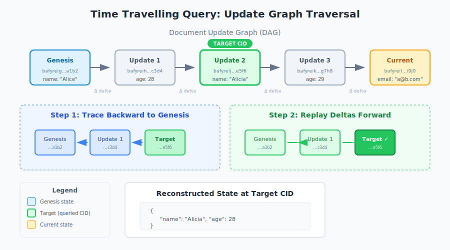

# Time Travelling Queries

## Overview

Time travelling queries let you retrieve a document exactly as it existed at any point in its history. Instead of seeing only the current state, you can inspect any previous version by specifying its commit identifier.

This capability is built into DefraDB's data model. Every document stores its complete history as a chain of updates, so "going back in time" requires no backups, snapshots, or additional infrastructure.

---

## Why This Matters

### The Problem with Traditional Databases

Traditional databases like MySQL or PostgreSQL store only the current state. When you update a record, the previous value is gone.

The only way to recover historical data is through backups—but backups have significant limitations:

| Challenge | Impact |
|-----------|--------|
| **Scheduled intervals** | Backups run hourly, daily, or weekly. Changes between intervals are lost forever. |
| **Full database restore** | To query one old record, you must restore the entire database from a backup file. |
| **Application-level tracking** | Some teams build custom history tables, but this requires significant development effort and ongoing maintenance. |

### How DefraDB Is Different

DefraDB takes a fundamentally different approach: **every update becomes part of the document's permanent history**.

Rather than overwriting data, each change is appended to an update graph. This means:

- Every version of every document is always accessible
- No backups are needed to view historical states
- Querying the past uses the same syntax as querying the present

---

## Key Concepts

### The Update Graph

When you modify a document in DefraDB, the change is recorded in an **update graph**—a directed acyclic graph (DAG) that captures every modification from creation to present.

```
[Genesis] → [Update 1] → [Update 2] → [Update 3] → [Current State]
    ↑                                                      
  First                                               Most recent
  commit                                              commit
```

Each node in this graph represents a specific version of the document. The graph only points backward (each update references its predecessor), creating an immutable chain of history.

**Important details:**

- DefraDB maintains update graphs at both the document level and for individual fields
- Even deletions are recorded as updates—nothing is truly erased
- Each update stores only what changed (the "delta"), not the entire document

### Content Identifiers (CIDs)

Every update generates a **Content Identifier (CID)**—a unique hash that serves as the version's address.

CIDs are:
- **Content-based**: The hash is derived from the actual data, not an arbitrary version number
- **Constant-size**: Regardless of document size, CIDs are always the same length
- **Immutable references**: A CID always points to exactly the same data

Example CID: `bafybeieqnthjlvr64aodivtvtwgqelpjjvkmceyz4aqerkk5h23kjoivmu`

To query a historical version, you provide the CID of the commit you want to retrieve.

### Delta Payloads

Each update contains a **delta payload**—the minimal information needed to transition from one state to the next.

For example, if you change a user's name from "Alice" to "Alicia", the delta payload contains only:
```json
{ "name": "Alicia" }
```

This approach keeps the update graph compact while preserving complete history.

---

## How Queries Are Resolved

When you submit a time travelling query with a specific CID, DefraDB reconstructs that version using a two-step process:



1. **Trace backward**: Starting from your target CID, follow the graph back to the genesis state (the document's creation)

2. **Replay forward**: Apply each delta payload in sequence until reaching the target state

The result is the **serialized state**—the complete document as it existed at that commit.

:::tip Performance Note
For regular queries, DefraDB caches the current state, so no traversal is needed. Time travelling queries are slightly slower because they must reconstruct the historical state.
:::

---

## Limitations

### Document-Level Only

Time travelling queries return a single document's historical state. They cannot automatically include related documents at that same point in time.

**Example scenario:**

You have `Book` and `Author` collections where each book references an author. If you query a book at a historical CID:

| What you get | What you don't get |
|--------------|-------------------|
| The book's state at that commit | The author's state at that same moment |

To get related historical data, you must issue separate time travelling queries for each document using their respective CIDs.

### Performance Varies with History Depth

Query speed depends on how far back you're looking:

| Factor | Impact |
|--------|--------|
| **Update graph size** | More total updates = larger graph to potentially traverse |
| **Distance to target** | Older versions require replaying more deltas |

For documents with thousands of updates, querying very early versions will take longer than querying recent ones.

---

## Related Resources

- **[How to Use Time Travelling Queries](../How-to%20Guides/time-traveling-queries.md)** — Step-by-step instructions with examples
- **[MerkleCRDT](./merkle-crdt.md)** — The data model underlying DefraDB's history system
